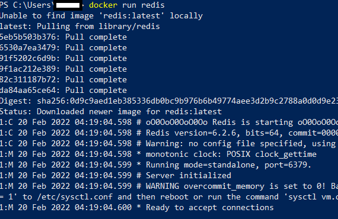
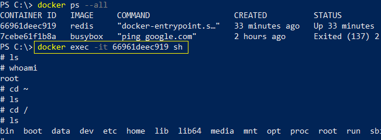

# Docker Quick Notes

```docker
docker run <image name>
docker run hello-world
```

Overriding default command

```docker
docker run <image name> <Overriding command>
docker run busybox echo hi there
docker run busybox ls
```
List all containers running in docker

```docker
docker ps
```
Ususlly this command may no snhow any output since a docker programme closes immediately after running what it is intended for. Therefore to see this 'ps' command working, we will need to keep some docker programme running in the background.

```docker
docker run busybox ping google.com
```
and then run 
```docker
docker ps
```

To list all containers in your docker
```docker
docker ps --all
```


Connecting from Ubuntu

```sh
ryarra@onbv:~$ docker ps
Got permission denied while trying to connect to the Docker daemon socket at unix:///var/run/docker.sock: Get "http://%2Fvar%2Frun%2Fdocker.sock/v1.24/containers/json": dial unix /var/run/docker.sock: connect: permission denied
ryarra@onbv:~$ sudo chmod 666 /var/run/docker.sock
[sudo] password for ryarra:


```

Docker create, start and run

Create simply creates the docker in your local computer and it gives the id of the docker

```docker
docker create hello-world
```
Running the create command will reflect different container id.

To start 

```docker
docker start -a <docker id>
```
If we don't put -a, the outputs of the docker will not be visible in the command prompt..

```sh
ryarra@onbv:~$ docker create hello-world
5514348fddaea46872b15cf5f23e1091c59a6d2e1a916dc202103ee58893d039
ryarra@onbv:~$ docker create hello-world
89dc39b9a909d799c2ecbadb70e1c9e8982454fb2f8a2b6f9971a258c11eeffb
```


To start
```
ryarra@onbv:~$ docker start -a 89dc39b9a909d799c2ecbadb70e1c9e8982454fb2f8a2b6f9971a258c11eeffb
```
> Hello from Docker!
> This message shows that your installation appears to be working correctly.
> 
> To generate this message, Docker took the following steps:
>  1. The Docker client contacted the Docker daemon.
>  2. The Docker daemon pulled the "hello-world" image from the Docker Hub.
>     (amd64)
>  3. The Docker daemon created a new container from that image which runs the
>     executable that produces the output you are currently reading.
>  4. The Docker daemon streamed that output to the Docker client, which sent it
>     to your terminal.
> 
> To try something more ambitious, you can run an Ubuntu container with:
>  $ docker run -it ubuntu bash
> 
> Share images, automate workflows, and more with a free Docker ID:
>  https://hub.docker.com/
> 
> For more examples and ideas, visit:
>  https://docs.docker.com/get-started/
> 

without -a, the output will be like

```sh
ryarra@onbv:~$ docker start  89dc39b9a909d799c2ecbadb70e1c9e8982454fb2f8a2b6f9971a258c11eeffb
89dc39b9a909d799c2ecbadb70e1c9e8982454fb2f8a2b6f9971a258c11eeffb
ryarra@onbv:~$

```

docker run is the combination of both docker create and docker start -a


Once a docker ran, we can rerun it with its id. To see all dockers irrespective of running or stopped status, we can use

```docker
docker ps --all
```
By fetching the docker id of a stopped container, we can rerun the docker again. However, if initially we had given a override command, this new run will also run the same command.

Say, we initially provided the command 
```docker
docker run busybox echo hello world
```
and assume that the docker had an id say <somne id>

if we issue the command

```docker
docker start -a <some id>
``` 
will also echo nhello world. However, if we don't provide `-a`, it will supress the `hello world` part. 

#### Erase the existing containers completely

To completely erase the containers, issue
```docker
docker system prune
```

It should display an warning message and once confirmed, it will erase all docker containers from your local machine. Next time if you want to start it again, it will need to be downloaded again.


#### View the logs of a docker container

We can view the logs of a container while the docker is not deleted.

```sh
docker create busybox echo hello there
PS C:\Users\xxx> docker start 8dea55842e1b3060de568cd53ecf53ee78f19bbeb998b6cf6a974eaab9dc3134
8dea55842e1b3060de568cd53ecf53ee78f19bbeb998b6cf6a974eaab9dc3134
PS C:\Users\xxx> docker logs 8dea55842e1b3060de568cd53ecf53ee78f19bbeb998b6cf6a974eaab9dc3134
hi there
```
`docker logs <docker id>` will show what was the output. Here the docker is not restarted again. Just getting the logs.
#### Stopping docker Container

Imagine a situation where you have used `docker create busybox ping google.com` - this command will continiously keep pinging google. To stop such situation, we can either use `stop` or `kill` command.

The primary difference between stop and kill is: stop allows some time to the internal process to do some cleanup - like saving a file, it actually says take your own time and then stop the process, internally it runs system `SIGTERM` command. But `kill` is not forgiving. It will immediately kill the entire process, no time to docker. Internally it runs `SIGKILL`. 

In docker environment, a kill command is automatically invoked when stop command doesn't work for 10 seconds. That means it only gives 10 s to save whatever it needs to, then the process will have to face mighty kill command.


```sh
  docker create busybox ping google.com
  docker start 7cebe61f1b8ad9467a76c797f8ba365e23565d388d0bf7d07782b4e3e6609bf4
  docker logs 7cebe61f1b8ad9467a76c797f8ba365e23565d388d0bf7d07782b4e3e6609bf4
  docker ps --all
  docker stop 7cebe61f1b8ad9467a76c797f8ba365e23565d388d0bf7d07782b4e3e6609bf4
  ```
Stop can't handle ping that easily, so, it waits for 10 sec and then invokes the `kill` command automatically. Therefore, we can see that this is killed only after 10 seconds.

On the other hand, it we invoke `kill`, the process stops immediately.

```sh
    docker kill <process-id>
```

### Running redis inside a docker.

Lets install redis inside a docker. But how to start it. Because, to start redis inside the docker will require to get inside the docker and then issue the redis-cli command. 

When we run `docker run redis` command, it starts redis as a server, but we need to access it from another terminal. 


Even though it is ready to accept connection, no way to write the commands. If we start another terminal and put redis-cli command, it doesnot work as redis is not available from outside the docker container. 

To address this issue, we will use `exec` command. This command is used to run an additional command inside a container.

The systax of the command is:
`docker exec -it <docker id> <Additional command>`

Practically,
```sh
# run another terminal and get the docker id first
PS C:\> docker ps -all
CONTAINER ID   IMAGE     COMMAND                  CREATED          STATUS          PORTS      NAMES
66961deec919   redis     "docker-entrypoint.s…"   16 minutes ago   Up 16 minutes   6379/tcp   great_brattain

# Run exec command 
#docker exec -it 66961deec919 redis-cli

PS C:\> docker exec -it 66961deec919 redis-cli
127.0.0.1:6379>
```
And it shows the redis prompt

Here the parameters -it actually stands for 

> -i : input
> 
> -t : text formatting


# Shell access to a docker container

This is the most important thing in docker. We would like to have shell access. With the -it flag we can get shell access too.

Practically:
```sh
# Confirm that a container is running, say redis
docker ps --all
docker -exec -it <container_id> sh 
```


We can also run `redis-cli` directly from shell prompt.

We can also call the shell from run command

```sh
docker run -it busybox sh
```


## How to build your own docker image


